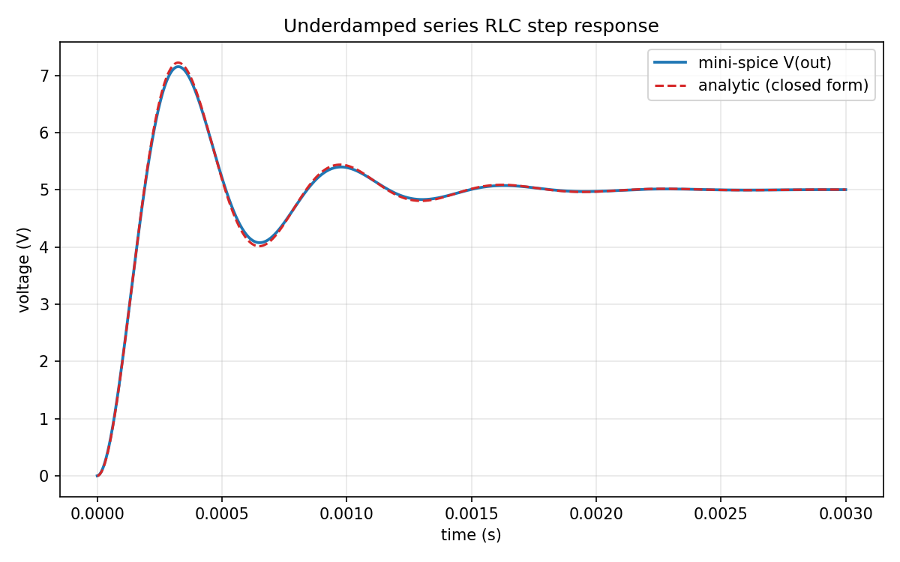
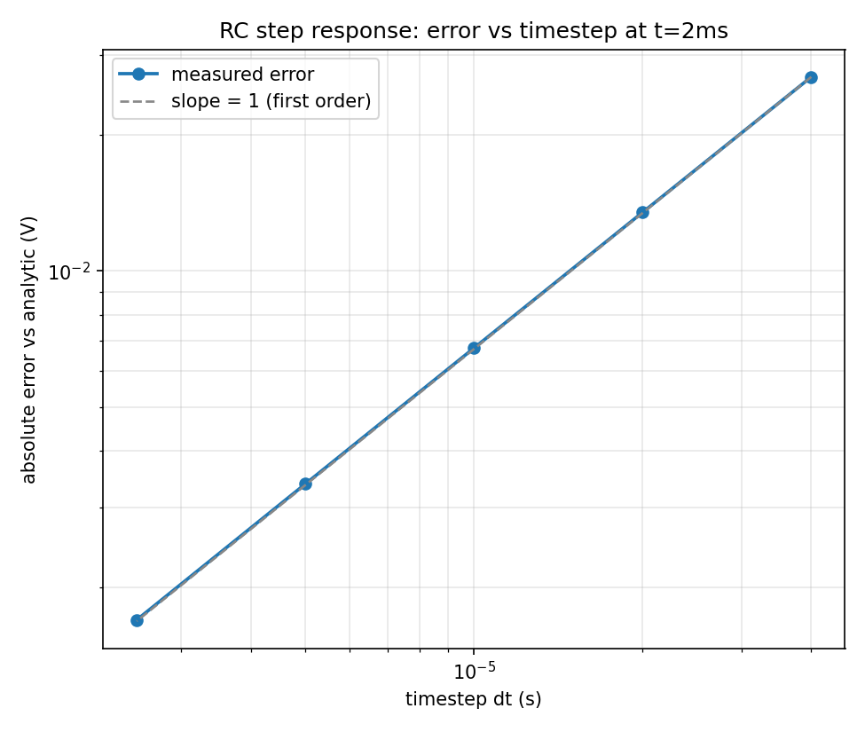
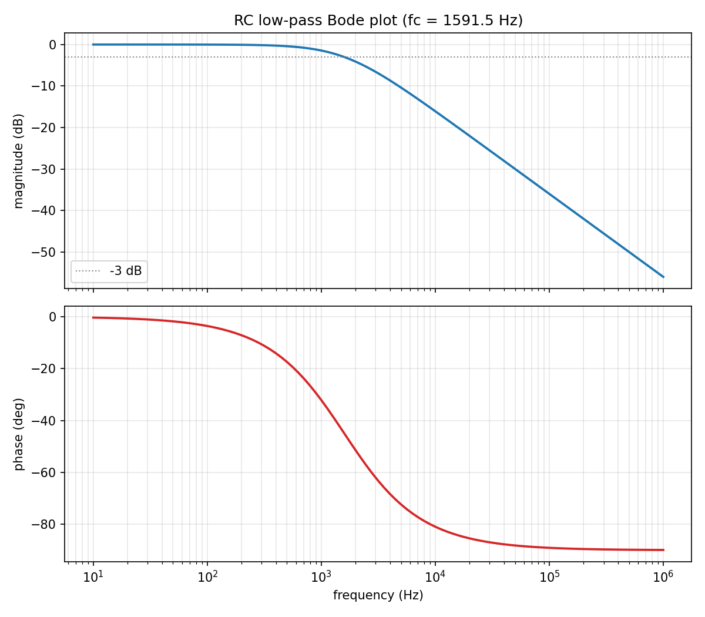

<!--
  Badge URLs below assume this repo is pushed to github.com/AryaA94/mini-spice.
  If you push it under a different name, update the four URLs in the badge
  block (CI, coverage, license link, and the "org/repo" in each).
-->
<p align="center">
  
</p>

<h1 align="center">mini-spice</h1>
<p align="center">A small SPICE-style circuit simulator, written from scratch in C++20.</p>
<p align="center"><b><a href="https://aryaa94.github.io/mini-spice/">Try it in your browser &rarr;</a></b> (the real C++ engine, compiled to WebAssembly)</p>

<p align="center">
  <a href="https://github.com/AryaA94/mini-spice/actions/workflows/ci.yml"></a>
  <a href="https://codecov.io/gh/AryaA94/mini-spice"></a>
  <a href="LICENSE"></a>
  
</p>

mini-spice solves circuits the way a real SPICE tool does: it builds a
Modified Nodal Analysis (MNA) system from a netlist and solves it with a
hand-written Gaussian elimination routine (no Eigen, no external linear
algebra library). It supports three analyses -- **DC operating point**,
**transient** (backward Euler), and **AC frequency sweep** -- for
resistors, capacitors, inductors, and independent voltage/current sources,
and it's validated three independent ways: against hand-derived closed-form
solutions, against an industry-standard SPICE implementation (ngspice), and
with a battery of edge-case and convergence tests.

There's also a [browser version](https://aryaa94.github.io/mini-spice/):
build a circuit (or load a preset), pick DC / transient / AC, and see the
results plotted. It runs the same C++ engine compiled to WebAssembly,
not a JavaScript rewrite -- see [`web/README.md`](web/README.md).

## Quickstart

```sh
cmake --preset default
cmake --build build/default
ctest --test-dir build/default
```

That configures, builds the library/CLI/test suite, and runs all 112 test
cases. Then try it on a circuit:

```sh
./build/default/minispice dc examples/01_voltage_divider/circuit.cir
./build/default/minispice tran examples/03_rc_step/circuit.cir --dt 1e-5 --stop 5e-3 --csv out.csv
./build/default/minispice ac examples/06_rc_lowpass_bode/circuit.cir --start 10 --stop 1e6 --ppd 20 --csv out.csv
```

## Results: mini-spice vs. the closed-form solution vs. ngspice

Every row below is checked against both an independently-derived analytic
formula *and* ngspice (an industry-standard SPICE implementation) run on
the identical netlist -- not just "it runs without crashing."

| Case | mini-spice | ngspice | analytic | % err vs analytic |
|---|---|---|---|---|
| Voltage divider, V(out) | 5.00000 | 5.00000 | 5.00000 | 0.0000% |
| Wheatstone bridge (balanced), V(a) | 6.00000 | 6.00000 | 6.00000 | 0.0000% |
| Diode+resistor (Newton-Raphson), V(a) | 0.692888 | 0.692891 | 0.692888 | 0.0000% |
| BJT fixed-bias (Ebers-Moll), V(col) | 5.81128 | 5.81128 | 5.81128 | 0.0000% |
| PNP fixed-bias (NPN mirror), V(col) | -5.81128 | -5.81128 | -5.81128 | 0.0000% |
| VCVS ideal 3x amplifier, V(out) | 6.00000 | 6.00000 | 6.00000 | 0.0000% |
| RC step, V(out) @ t=1ms | 3.15144 | 3.16061 | 3.16060 | 0.2901% |
| RC step, V(out) @ t=3ms | 4.74733 | 4.75107 | 4.75106 | 0.0785% |
| Underdamped RLC, V(out) @ t=1.0ms | 5.38835 | 5.42396 | 5.42388 | 0.6535% |
| Underdamped RLC, V(out) @ t=1.5ms | 5.00637 | 5.01616 | 5.01621 | 0.1963% |
| Overdamped RLC, V(out) @ t=2.0ms | 3.15967 | 3.16060 | 3.16060 | 0.0294% |
| RC low-pass, \|V(out)\| @ f_c=1591.5Hz | -3.01013 dB | -3.01013 dB | -3.01030 dB | 0.0057% |

**DC and AC rows match to floating-point precision** (0.0000% against
ngspice) -- expected, since both are a single linear solve with no time
discretization. The diode and BJT rows are *nonlinear* DC solves
(Newton-Raphson, see below) and still match both ngspice and an
independently-derived reference (Lambert W for the diode; a from-scratch
Newton-Raphson written fresh in Python for the BJT) to within 0.0005%.
AC analysis of diode/BJT circuits works too (a DC bias point is computed
first, then linearized, matching standard SPICE `.AC` behavior) -- see
`docs/ngspice_comparison.md` for how that's validated independently of
ngspice entirely, via a finite-difference cross-check. The small transient
error (under 0.7% everywhere above) is
backward Euler's known first-order truncation error at the chosen
timestep, confirmed to actually be first-order by the convergence plot
below and by `tests/unit/test_convergence.cpp`. Full methodology and the
complete 20-row comparison: [`docs/ngspice_comparison.md`](docs/ngspice_comparison.md).
Reproduce this table yourself: `python3 tools/compare_to_spice.py`
(requires `ngspice` on `PATH`).

## Convergence: confirming first-order accuracy

<p align="center">
  
</p>

Halving the timestep roughly halves the error -- the signature of a
correctly-implemented first-order method. This is checked as a hard
pass/fail assertion in `tests/unit/test_convergence.cpp`, not just eyeballed
from the plot.

## Bode plot

<p align="center">
  
</p>

## Supported components

| Component | DC | Transient | AC |
|---|---|---|---|
| Resistor (`R`) | ✅ | ✅ | ✅ |
| Voltage source (`V`) | ✅ | ✅ (constant, or `PULSE`/`SIN`) | ✅ |
| Current source (`I`) | ✅ | ✅ (constant, or `PULSE`/`SIN`) | ✅ |
| Capacitor (`C`) | ✅ | ✅ | ✅ |
| Inductor (`L`) | ✅ | ✅ | ✅ |
| Diode (`D`, Newton-Raphson) | ✅ | ✅ | ✅ (bias point + linearize) |
| BJT (`Q`, NPN or PNP, Ebers-Moll) | ✅ | ✅ | ✅ (bias point + linearize) |
| VCVS (`E`), VCCS (`G`) -- linear | ✅ | ✅ | ✅ |

Full netlist syntax reference: [`docs/SUPPORTED_COMPONENTS.md`](docs/SUPPORTED_COMPONENTS.md).

## Documentation

- [`docs/ARCHITECTURE.md`](docs/ARCHITECTURE.md) -- module layout and data flow
- [`docs/DESIGN_DECISIONS.md`](docs/DESIGN_DECISIONS.md) -- every non-obvious
  choice explained from first principles, including the full backward-Euler
  companion-model derivations with sign checks, why the DC operating point
  approximates an inductor as a small resistance instead of an ideal short,
  and how the `t=0` transient sample is computed without a second stamping
  mode
- [`docs/SUPPORTED_COMPONENTS.md`](docs/SUPPORTED_COMPONENTS.md) -- netlist syntax
- [`docs/ngspice_comparison.md`](docs/ngspice_comparison.md) -- full cross-validation results

## Testing

```sh
ctest --test-dir build/default --output-on-failure
```

112 test cases / 155,000+ assertions, covering:

- **Unit tests** -- hand-computed linear systems for the Gaussian
  elimination solver (including a case requiring partial pivoting, and one
  over `std::complex<double>`); exact matrix/RHS entries for every
  component's stamp, verified by hand, not just "does it run."
- **Analytic validation** -- voltage divider (exact fraction), Wheatstone
  bridge (balance condition), RC step response, all three RLC damping
  regimes (under/over/critically damped), AC magnitude+phase of an RC
  low-pass including the -3dB corner, a diode+resistor operating point
  checked against a closed-form Lambert-W solution, two BJT operating
  points each checked against a from-scratch Newton-Raphson solve written
  independently in Python, a PNP circuit checked as the exact mirror of
  its NPN counterpart, VCVS/VCCS circuits checked against their exact
  linear-algebra answers, and PULSE/SIN waveform shapes checked point-by-
  point against their hand-derived closed forms -- every one of these
  checked against an independently-derived reference, not just against
  itself.
- **Convergence** -- halving the timestep must roughly halve the error;
  this is exactly the kind of test that catches an integration scheme
  that's subtly the wrong order while still "looking right" on one plot.
- **Golden-file regression** -- every example circuit's output is pinned
  and re-diffed on every run.
- **Edge cases** -- a floating node, two voltage sources shorted together,
  zero/negative component values, malformed netlist lines, and a
  Newton-Raphson iteration that fails to converge all produce a clear,
  catchable error naming the problem -- never a crash and never a silent
  wrong answer.

CI (`.github/workflows/ci.yml`) runs the full suite on Linux, Windows, and
macOS, plus a dedicated AddressSanitizer + UndefinedBehaviorSanitizer job on
the matrix/solver code, and reports coverage (currently 92% line coverage
on `src/`+`include/`, measured locally with `gcov`/`gcovr`; most solver
files are 85-100%, with the remaining gaps concentrated in hard-to-construct
failure paths like a Newton-Raphson iteration that genuinely exhausts its
100-iteration budget without an already-singular matrix along the way).

## Limitations and roadmap

- **No MOSFET.** The BJT's Ebers-Moll/Newton-Raphson machinery is the
  right foundation, but a MOSFET's square-law (or better) equations are
  different physics, not a mirror or a generalization of anything already
  here -- a genuinely new model, not a quick follow-up.
- **No PWL (piecewise-linear) source waveform.** `PULSE` and `SIN` are
  supported (see [`docs/DESIGN_DECISIONS.md`](docs/DESIGN_DECISIONS.md#17-time-varying-sources-pulsesin-why-this-needed-an-interface-change));
  an arbitrary `PWL(t1 v1 t2 v2 ...)` breakpoint table is a natural
  follow-up using the same `Waveform::value_at(t)` mechanism, just with
  table lookup instead of a closed-form piecewise formula.
- **No schematic rendering.** Plots are numeric (waveforms, Bode plots);
  there's no auto-layout SVG schematic view next to them -- a different
  discipline (layout/graphics) from everything else in this repo.
- **Single right-hand-side solve per system.** Each timestep/frequency
  point rebuilds and re-factors the whole matrix from scratch rather than
  reusing a factorization across RHS-only changes (e.g. LU decomposition
  reuse). Fine at this circuit size; would matter for much larger netlists.

## Development notes

Built with the help of Claude Code.
